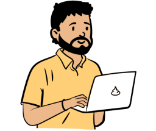

 
 

 <h1 align="left">Gustavo Pumachagua Perez</h1>

 

## Hello, Devs!!

I live in Lima - Peru and I am passionate about programming. I am a beginner in the programming universe, a bug hunter and the more I learn and the more I get angry, the more I love it. ✌

  

### 🖥️ Technologies and Tools:

<code></code>
<code></code>
<code></code>
<code></code>
<code></code>
<code></code>
<code></code>
<code></code>
 
 

 
📚 I have studied Javascript and React in Platzi here I have my <a href="https://platzi.com/p/gustavopumachagua/" target="_blank">certificates.</a> 

  
📷 I share my experiences with career transition, study tips and technology in my <a href="https://gussdev.notion.site/Desarrollo-Web-cd33325b6e8b4db9bf28271a31d3743a" target="_blank">Blog.</a>

 

##

##

<a href="https://github.com/gustavopumachagua">
  
   
  
</a>

